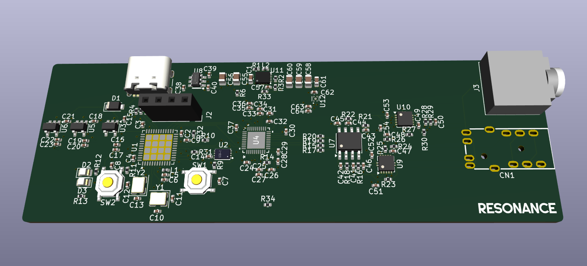
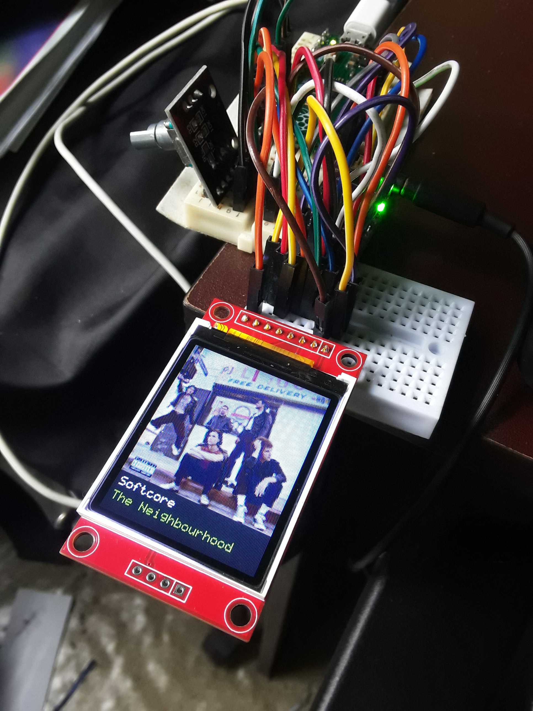
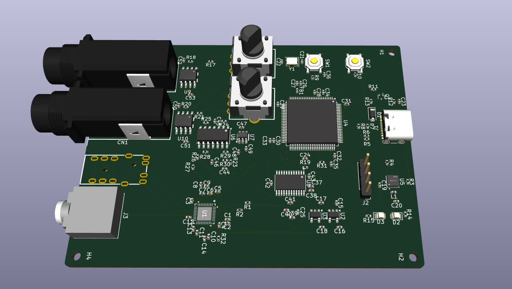
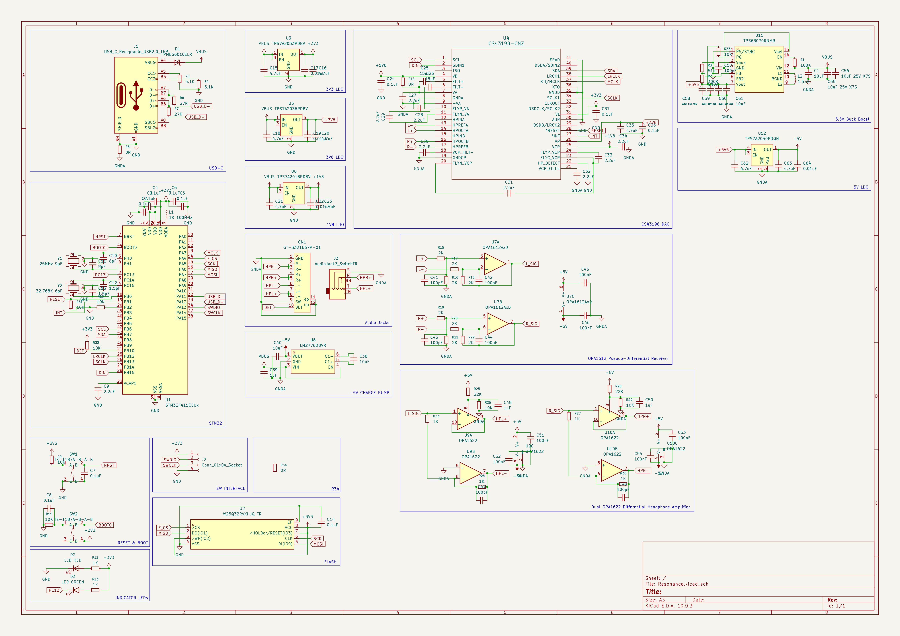

# Resonance
An open-source USB-C Audio Interface powered by an STM32F411 and using a Cirrus Logic CS43198 DAC chip.

This is my magnum opus (*seriously*)

## Features
* STM32F411 microcontroller for USB audio
* Cirrus Logic CS43198 DAC with pseudo-differential output
* OPA1622 Differential Headphone Amplifier

## Rough Timeline
* (May 2026) - Raspberry Pi Pico + PCM5102

* (August 2026) - Stuck with the Pico because of it's versatility, however I decided to use a professional Cirrus Logic CS43198 chip
* (September 2026) - Switch to an STM32H743 (way too overpowered, what was I thinking), and included a CS5361 ADC with dual-channel op-amps for two mic inputs

* (October 2026) - Realized I would face a lot of power-related problems so I downgraded to an STM32F411 and kept only the CS43198 DAC. Also completely revamped the schematic so it would be easy to read
